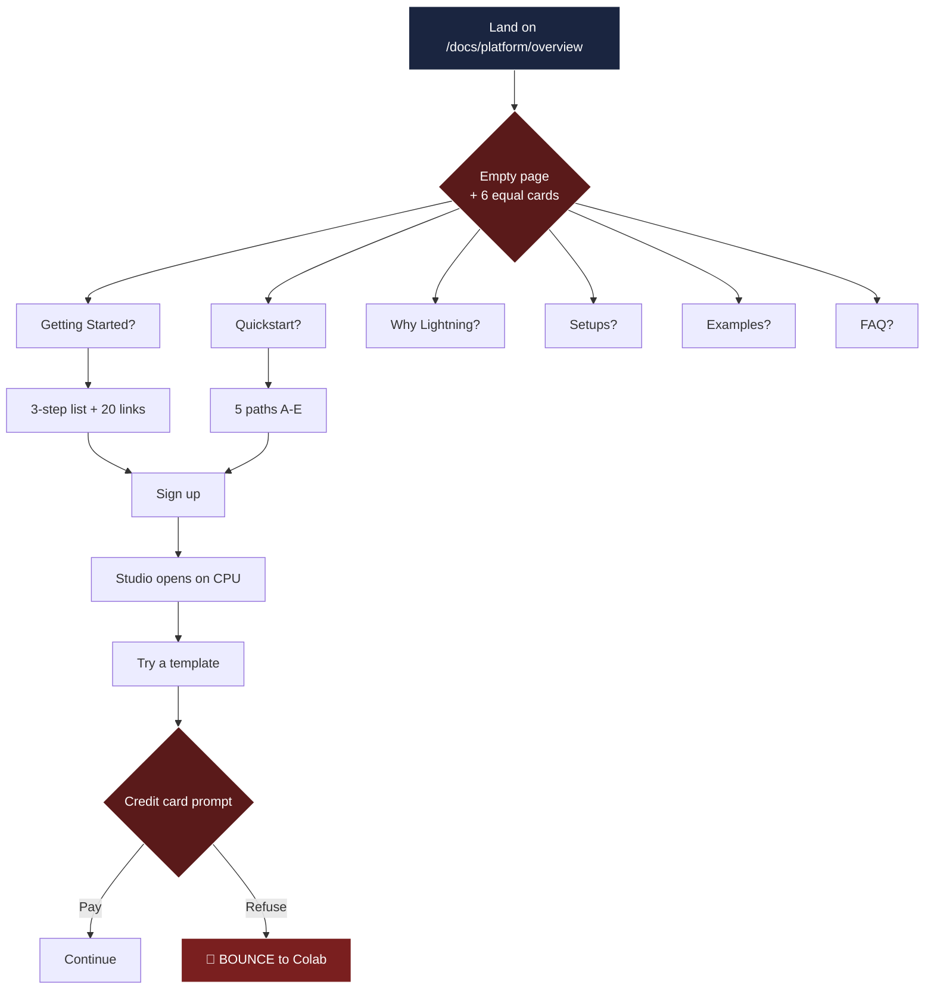
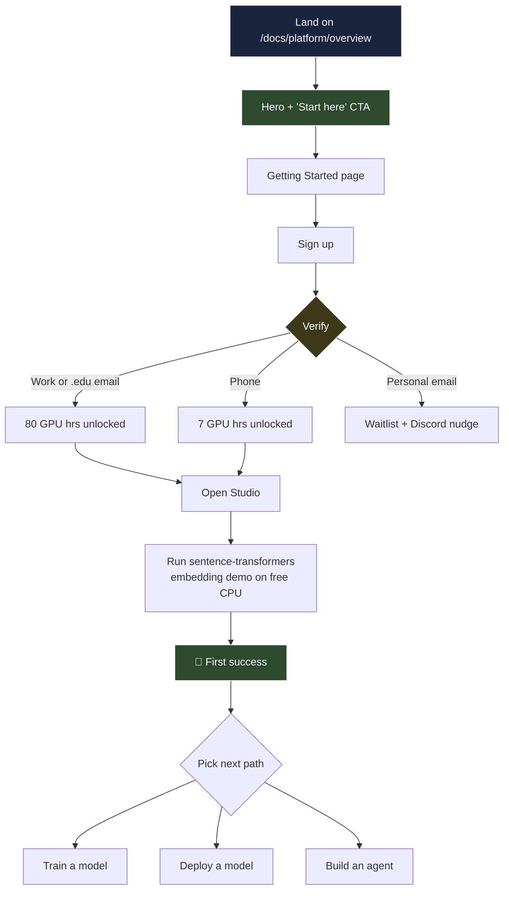

# User journey: current vs proposed

Both diagrams trace the same goal: a brand-new developer arriving at lightning.ai/docs wanting to run their first AI workload.

## Today (current docs)

**Drop-off moments highlighted in red.** A new developer hits three friction points before they ever run code: choosing between 6 equally-weighted cards, choosing between two competing quickstarts, and a credit card prompt that's not explained anywhere in the docs.

## Proposed redesign

**One linear path through first success.** Branching is offered only after the user has run something. The verification gate that unlocks free GPU access is made explicit, not hidden in FAQ.

## What changed and why

| Friction in current flow | Fix in redesign |
|---|---|
| Overview = 6 equal cards, no recommendation | One hero + "Start here" CTA pointing at Getting Started |
| Getting Started AND Quickstart compete | Merged into one canonical path |
| Quickstart uses choose-your-own-adventure (A-E) at step zero | One linear path; branching at the end |
| Credit card prompt without context | Verification step (email/phone) made explicit before any template click |
| "Free CPU, switch to GPU later" not actionable | Verification table tells you exactly what unlocks what |
| Success state not defined | Every step ends with "you should see X" |
| 20-link table for next steps | 3 prioritized cards |

## Time-to-first-success target

- **Current docs**: empirically 10+ min if user perseveres past the credit card prompt; many bounce before running anything.
- **Redesign target**: 5 min from `/docs/platform/getting-started` to `python main.py` printing output. Validated against the actual signup + Studio + sentence-transformers install + run sequence.
